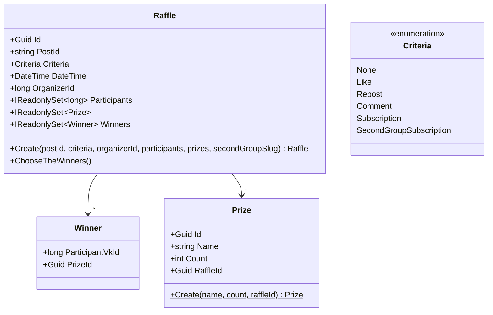

```mermaid
classDiagram
    Raffle --> "*" Winner
    Raffle --> "*" Prize

    class Raffle{
        +Guid Id
        +string PostId
        +Criteria Criteria
        +DateTime DateTime
        +long OrganizerId
        +IReadonlySet~long~ Participants
        +IReadonlySet~Prize~ 
        +IReadonlySet~Winner~ Winners
        +Create(postId, criteria, organizerId, participants, prizes, secondGroupSlug)$ Raffle
        +ChooseTheWinners()
    }
    class Prize{
        +Guid Id
        +string Name
        +int Count
        +Guid RaffleId
        +Create(name, count, raffleId)$ Prize
    }
    class Winner{
        +long ParticipantVkId
        +Guid PrizeId
    }
    class Criteria{
        <<enumeration>>
        None
        Like
        Repost
        Comment
        Subscription
        SecondGroupSubscription
    }
```
